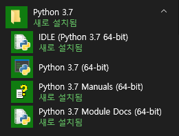

# Python 정리_기본부터 차근차근

## 1. 파이썬 설치하기

#### 윈도우에서 파이썬 설치하기

- 파이썬 공식홈페이지의 다운로드 페이지 (https://www.python.org/downloads/)
- 나는 3.7.4 버전을 다운받을 거다.

다운로드가 완료된 윈도우 파이썬 인스톨러이다.

클릭해서 설치를 시작한다.(★path설정 중요!)

파이썬이 정삭적으로 설치되었으면 다음 그림과 같이 프로그램 메뉴에서 확인할 수 있다.

**[ 시작 - 모든프로그램 - Python 3.7 ]**

## 2. 파이썬 기초, 자료형

### 2.1 숫자형

### 2.2 문자열 자료형

### 2.3 리스트 자료형

### 2.4 튜플 자료형

### 2.5 딕셔너리 자료형

### 2.6 집합 자료형

### 2.7 불 자료형

### 2.8 변수(자료형의 값을 저장하는 공간)

## 3. 제어문

### 3.1 if 문

### 3.2 while 문

### 3.3 for 문

## 4. 프로그램의 입력과 출력

### 4.1 함수

### 4.2 사용자 입력과 출력

### 4.3 파일 읽고 쓰기

